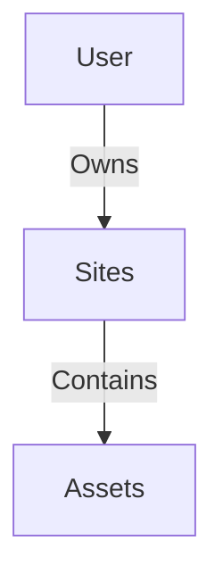

# **User & Site Management**

## **Core Relationships**


### **1. User Class**
- **Purpose**: Represents system users (owners/admins)
- **Key Properties**:
  - `Id`: Auto-incremented unique identifier
  - `Name`: User's display name
  - `Sites`: List of owned sites (initially empty)

- **Critical Method**:
  ```csharp
  AddSite(Site site)  // Links a site to this user
  ```

### **2. Site Class**
- **Purpose**: Physical locations containing energy assets
- **Key Properties**:
  - `Id`: Auto-incremented unique identifier
  - `UserId`: Owner reference
  - `Name`/`Location`: Descriptive metadata
  - `Assets`: List of renewable assets (batteries, solar panels, etc.)

- **Critical Method**:
  ```csharp
  AddAsset(Asset asset)  // Deploys an asset to this site
  ```

---

## **Workflow Example**
1. **Create User**
   ```csharp
   var user = new User(config);
   ```

2. **Add Site**
   ```csharp
   var site = new Site(siteConfig, userId: user.Id);
   user.AddSite(site);
   ```

3. **Deploy Assets**
   ```csharp
   var battery = new Battery(batteryConfig, siteId: site.Id);
   site.AddAsset(battery);
   ```

---

## **Design Benefits**
| Feature                | Advantage                                                                 |
|------------------------|--------------------------------------------------------------------------|
| **Auto-Increment IDs** | Prevents manual ID management                                            |
| **Clean Hierarchy**    | Mirrors real-world ownership (User → Site → Asset)                       |
| **Type Safety**        | `List<Asset>` ensures only valid assets can be added                     |
| **Config-Driven**      | Names/locations injected via `SiteConfig`/`UserConfig`                   |

---

## **Why This Structure?**
1. **Logical Grouping**  
   - Assets belong to physical sites (not directly to users)
   - Example: A factory (site) with 10 solar panels, owned by a company (user)

2. **Simplified Queries**  
   - Find all assets for user:
     ```sql
     SELECT * FROM assets WHERE site_id IN 
       (SELECT id FROM sites WHERE user_id = 123);
     ```

3. **Scalability**  
   - Users can manage multiple sites  
   - Sites can hold mixed asset types  

---